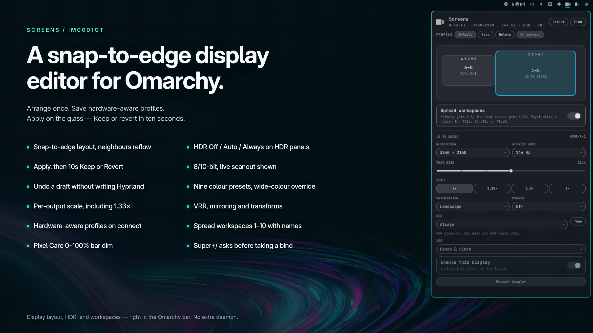
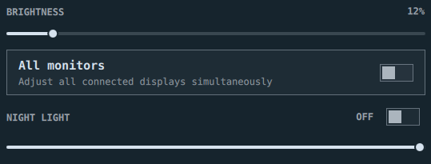

# Screens

An Omarchy bar widget for arranging displays and setting how they look.

Click the two-tile mark for a panel that stays open. Displays are drawn at their real Hyprland size. Drag them and they **snap flush** — no overlapping tiles, no cursor-eating gaps. Stacking a screen above or below another also gets a **light center snap**, easy to pull off if you want it offset. Then set brightness, text size, resolution, refresh, HDR, VRR, scale, rotation, and mirroring. Save the desk as a named **profile**; Screens can restore it when a display is plugged in.

<p align="center">
  
</p>

| Layout | This screen | Night Light | HDR | Profiles | Workspaces | Pixel Care |
| --- | --- | --- | --- | --- | --- | --- |
| Drag tiles; edges snap, neighbours reflow. Apply, then 10s Keep / Revert | Brightness, All monitors toggle, text size, resolution, Hz, scale slider, rotation, mirror, Detect | 1500K–6500K Kelvin slider, instant toggle, hyprsunset sync | 8-bit or 10-bit PQ on HDR panels, Tune for black / peak | Name a desk; restore on connect | Optional spread of 1–10; right-click name, icon, Tile / Scroll / Float | Optional 0–100% bar dim, hover lift, no black veil |

Works with two screens or a full battlestation. A fallback Hyprland rule still catches anything you hot-plug later. The panel scrolls when it is taller than the screen, so controls stay reachable at large scale (for example 2× on 1080p).

Stock **Display** can stay on the bar if you want it. Screens uses a different icon on purpose.

## Why this exists

Omarchy's Display widget does brightness, text size, and scale. It does not arrange monitors or expose HDMI 2.1 features.

Other listed tools cover adjacent jobs:

- **Stock Display** — backlight, font size, scale presets, enable/disable
- **hyprmoncfg** — named profiles and a hotplug daemon. If that plugin or `hyprmoncfgd` is still installed, it stays in control of screen settings. Screens warns and yields until **you** remove it; it will not disable another plugin or daemon for you
- **HyprMod** — GTK settings app. If it still has per-display monitor rules, those load after `monitors.lua` and win. Screens warns until **you** open HyprMod, click the trash can next to each managed display, and save; it will not delete HyprMod's rules for you
- **Generic layout editors** — often reuse the stock monitor glyph, skip snap, and leave HDR/VRR in `monitors.lua`

Screens keeps the editor in the bar, follows the theme, and writes Hyprland Lua only after you act. No AUR package. No extra daemon.

## Install

Plugins run as unsandboxed code inside `omarchy-shell`. Only add repos you trust.

```bash
omarchy plugin add https://github.com/IM0001GT/omarchy-screens --enable
```

That places the plugin in `~/.config/omarchy/plugins/im0001gt.screens/` and can drop the widget on the right side of the bar, next to Display.

The first time Screens runs, it copies every stock file it may change into `~/.local/state/im0001gt.screens/originals/` (and a copy of `monitors.lua` at `original-monitors.lua`). Those copies are never overwritten, live outside the plugin directory, and do not depend on a system snapshot. It then starts from a **fresh** Screens-owned `monitors.lua` taken from the live Hyprland layout, so leftover edits from hyprmoncfg or another layout tool cannot keep controlling the desk.

If the [hyprmoncfg](https://github.com/crmne/omarchy-hyprmoncfg) plugin or its `hyprmoncfgd` daemon is still present, the Screens panel warns that it will stay in control until **you** remove it. Screens does not remove other plugins or stop other daemons. Typical cleanup is `omarchy plugin remove crmne.hyprmoncfg`, then stop `hyprmoncfgd` yourself if it is still running. The package is left in place unless you uninstall it.

If [HyprMod](https://github.com/BlueManCZ/hyprmod) is managing displays, its `hyprland-gui.lua` (or `.conf`) rules load after Screens and keep winning. Open HyprMod, click the trash can next to each monitor, and save. You can keep HyprMod for other settings. Screens does not remove those rules.

## Use

**Layout**

- **Click** the two-tile icon — the panel stays open until you click away
- **Drag** a tile — edges snap so the cursor never falls in a gap. Dropping a screen above or below another also snaps to **horizontal center** if you are close; keep dragging to park it off-center
- **Find** — badge on the *selected* output (not only the screen that holds the menu)
- **Detect** — rescan Hyprland and DRM for a plugged-in screen that is currently off, then **Turn on**. If it is listed but stays blank, restart Hyprland or the machine
- **Enable this Display** turns a screen off. On a non-primary GPU that can leave the panel blank until Hyprland or a reboot; Detect still finds it
- **Make primary** chooses which screen the panel prefers when it opens

**This screen**

- Pick a screen, then set **brightness**, **night light temperature**, **text size**, **resolution**, **refresh**, **scale**, **orientation**, or **mirror**. Scale is per output (slider to 0.01, including 1.33×). Text size is remembered per display; Omarchy only has one desk font, so Apply uses that display's value
- Layout, HDR, scale, and text size stay in the panel until **Apply**. **Undo** throws the draft away. Apply previews on the displays with a **10 second Keep / Revert**. Closing the panel without Keep undoes or reverts
- **Super+/** and **Super+Alt+/** step the focused display's scale when those keys still belong to stock Display scaling. If you already bound them to something else, Screens asks before taking them (or offers Super+Ctrl+/ instead)
- **Brightness & All Monitors**: Brightness follows the selected output (internal backlight or DDC). Directly beneath the slider, check **All monitors** to adjust brightness across every connected screen simultaneously.
- **Night Light (Color Temperature)**: Directly beneath brightness, dial your exact color temperature from `1500K` (warm amber) to `6500K` (crisp daylight) with a live Kelvin slider and On/Off toggle switch. Synchronizes automatically with `hyprsunset` and the Omarchy status bar.

<p align="center">
  
</p>
- Text size uses Omarchy's 9–20 px stops and applies to the shell, GTK, and terminals
- Laptop built-in panels are written as `eDP-1` / `LVDS` / `DSI` so Omarchy's clamshell helper keeps your scale instead of forcing 2
- Labels use Hyprland's model string

**HDR and VRR**

- **HDR**: **Off**, **Auto**, or **Always**. Auto keeps the desktop in SDR and only switches to HDR for fullscreen games and video (`cm_auto_hdr`). Always leaves PQ on all the time and can wash out HDR-ready LCDs
- **Tune** (Auto or Always): 8-bit or 10-bit (Hyprland's real output depths), nine colour presets, wide-colour EDID override, SDR brightness/saturation/transfer, black floor, and SDR peak. Live scanout format is shown, not invented bit depths
- Color space **Display** uses this panel's EDID primaries. **Wide** is BT.2020. HDR-ready LCDs that are not full wide-gamut should stay on Display
- HDR and VRR disable themselves when that panel cannot do them
- VRR modes: Off, Always, Fullscreen, Games & video. Always + HDR can flicker on some OLEDs; Fullscreen or Games & video is the usual workaround

**Bar care**

- **Pixel Care** (under Detect / Find) dims bar widgets 0–100% without a black veil, so a transparent or themed bar keeps that look
- Hover can lift the dim. Off until you turn it on

**Workspaces**

- **Spread workspaces** pins ten workspaces across the screens that are on and not mirroring
- Two screens: primary gets **1–5**, the next screen gets **6–10**. More screens split the ten as evenly as possible (a leftover slot goes to the first screens). Nine screens means one gets two workspaces and the rest get one
- **Make primary** chooses which screen receives the first group
- Each display's bar then shows only that screen's numbers. **Left-click** a number to go there. **Right-click** that same number to **name** it, pick an **icon**, or set **Tile**, **Scroll**, or **Float**. Those choices apply only to that workspace
- If the active workspace has a name, it appears as a chip next to the numbers
- Turning the toggle off restores Omarchy's stock workspace widget and leaves windows where they are

**Profiles**

- **Save** names the current layout. Click the profile name (or **Apply**) to write it. Two or more profiles become a dropdown
- **On connect** reapplies a matching profile when a display is plugged in
- Turning a display on, or turning **Mirror** off, restores the matching saved layout instead of leaving tiles stacked

Changes write `~/.config/hypr/monitors.lua` after you drag, turn a display on, or save. Later applies keep a short rolling set of timestamped copies in `~/.local/state/im0001gt.screens/`. Leftover rules from stock Omarchy, hyprmoncfg, or another editor are replaced after the original file is copied aside.

Move it with `omarchy bar move im0001gt.screens`.

## Multi-GPU desks

If Hyprland is painting on one GPU and another panel is plugged into a second GPU, idle standby or **Enable this Display** off can leave that output blank until Hyprland or a reboot. Screens only Hyprland-DPMS the **primary** GPU on idle; any display on another GPU stays on but black. Detect can still find a disabled output. A one-time note appears the first time you open the panel.

Resolution lists come from Hyprland / the EDID. A DP-to-DVI adapter that only advertises 2560×1440@60 will only show that mode.

## Update

```bash
omarchy plugin update im0001gt.screens --yes
omarchy restart shell
```

## Uninstall

Restore the pre-Screens files first, then remove the plugin:

```bash
~/.config/omarchy/plugins/im0001gt.screens/scripts/display-ctl restore-original
omarchy plugin remove im0001gt.screens
```

That puts back `monitors.lua`, `bindings.lua`, `shell.json`, and any workspace-layout files Screens captured, then removes the scale-key block and the brightness wrapper Screens added.

Omarchy does not run an uninstall hook. If the plugin is already gone, the same restore still works from the first-install copy (it survives `plugin remove` and is independent of Timeshift or other system snapshots):

```bash
~/.local/state/im0001gt.screens/restore.sh
```

Profiles stay in `~/.local/state/im0001gt.screens/` until you delete that directory.

## Security and data

Plugins run as unsandboxed code inside `omarchy-shell`. Screens does not use the network at runtime, does not ship binaries, and does not request extra privileges. It writes only files under your home directory:

- `~/.config/hypr/monitors.lua` — layout, scale, HDR, VRR
- `~/.config/hypr/bindings.lua` — Super+/ and Super+Alt+/ scale keys
- `~/.config/omarchy/shell.json` — only if you turn on workspace spreading, to swap the workspace widget
- `~/.local/state/omarchy/workspace-layouts/` — Tile / Scroll / Float per workspace
- `~/.local/state/im0001gt.screens/` — profiles, backups, Pixel Care settings (`bar-care.json`), and the restore helper

## Requirements

- [Omarchy](https://omarchy.org/) with the shell plugin CLI (`omarchy plugin add`)
- Hyprland 0.55+ Lua monitor config (`hl.monitor`)
- `python3` and `jq` (already on Omarchy)

Hyprland HDR is PQ (`cm = hdr` or `hdredid`) at 8-bit or 10-bit. There is no HLG preset. Some capture tools do not like 10-bit.

## Layout

```text
manifest.json            Omarchy plugin manifest (must live at repo root)
Screens.qml              Bar icon + click panel
ScreenMark.qml           Two-tile bar/hero mark
Workspaces.qml           Per-display workspace numbers (right-click layout)
WorkspaceLayoutMenu.qml  Name, icon, Tile / Scroll / Float picker
Service.qml              Registers the workspace widget
Model.js                 Snap / normalize / workspace split helpers
scripts/display-ctl      hyprctl snapshot, monitors.lua writer, hyprmoncfg / HyprMod check, scale keys
preview.png              Marketplace still
```

The repo root **is** the plugin. That is what `omarchy plugin add` and `omarchy plugin validate` expect.

## License

MIT. See [LICENSE](LICENSE).
